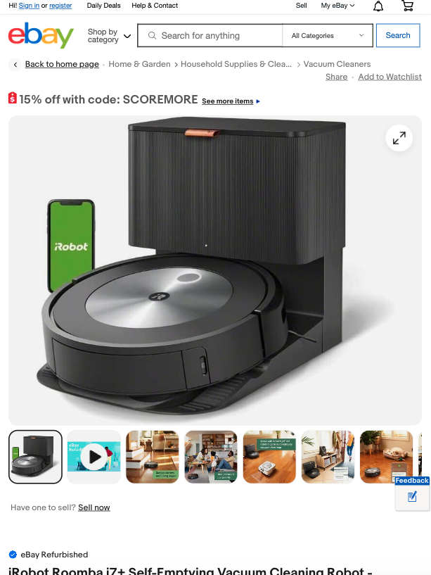
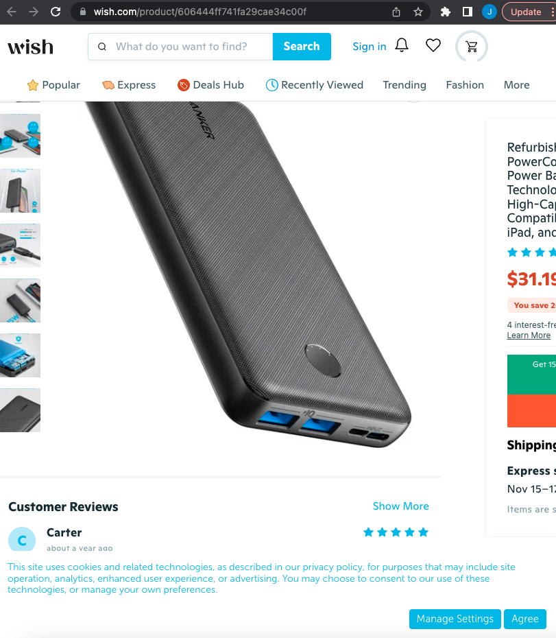
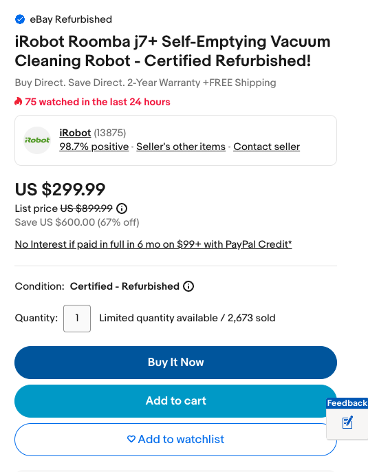
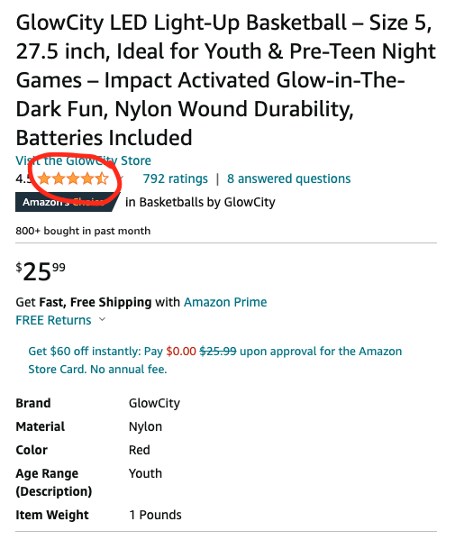
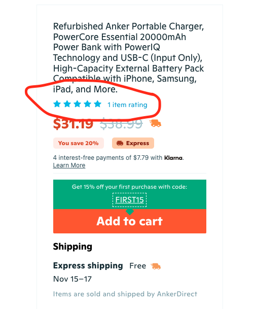

# eBay Case Study

This case study focuses on the analysis of eBay, a globally renowned online marketplace that connects buyers and sellers, offering an extensive array of products across various categories, both new and used. It is one of the largest e-commerce platforms, providing users with options to buy and sell through auctions or fixed-price listings, making it suitable for casual sellers and professional businesses.

For this analysis, the following methods were employed:

- **Site Research**: Investigating the website's structure, content, and functionality.
- **Click-through and Assessment**: Navigating the website and assessing user interactions.

One positive observation while viewing an item on the desktop eBay website is the implementation of a media query for the screen width. If the screen width is less than 768px, the website changes to a single column layout with the search bar at the top, the item photo below it, and all relevant information placed beneath the photo. This approach can improve user experience for users who open multiple windows on their desktop. Both Wish and Amazon's websites do not adapt to a narrower screen width, causing content to disappear as the width decreases.

Another noteworthy observation pertains to Wish directly. eBay and Amazon both have a 'Buy It Now' button, while Wish requires users to add items to their cart before making a purchase (can be seen in the images below). This additional step on Wish could potentially discourage impulse buying, as it complicates the purchase process.

eBay seems to follow a general design pattern common to other online selling websites like Wish and Amazon, displaying general categories for users, showcasing the latest deals, providing seller reviews, and offering product descriptions at the bottom of the page.

One issue that caught my attention is in eBay's product display. When viewing a product, there are no individual user reviews for purchased products. While Wish and Amazon display user reviews for the product, Amazon goes a step further by allowing users to post pictures and videos along with their reviews.

The lack of product-specific reviews on eBay may lead users to leave the eBay website in search of reviews (which could be frustrating). It could also lead users to a similar item on a competitor's website (potentially at a better price point), resulting in lost sales for both the seller and eBay.

I believe that having a readily available and reliable source of reviews is crucial for helping users make informed purchasing decisions. It enables users to quickly access the information they need to decide whether to buy a product and helps eBay gather insights into customer satisfaction. I recommend that eBay implement a feature that allows users to leave reviews, including photos and videos, to enhance the overall shopping experience.

Being a lifelong user of Ebay, i've witnessed firsthand the transformation of Ebay's interface throuought the years. To be entirely honest, I didn't notice how similar Ebay has become to Amazon when compared side by side, and i'm sure this was intentional. Despite the clear attempts to closely mirror competitor practices, issues around product ambiguity leave Ebay a step below their competitors. It could leave customers with a sense of unease in relation to the quality of the product they just purchased.