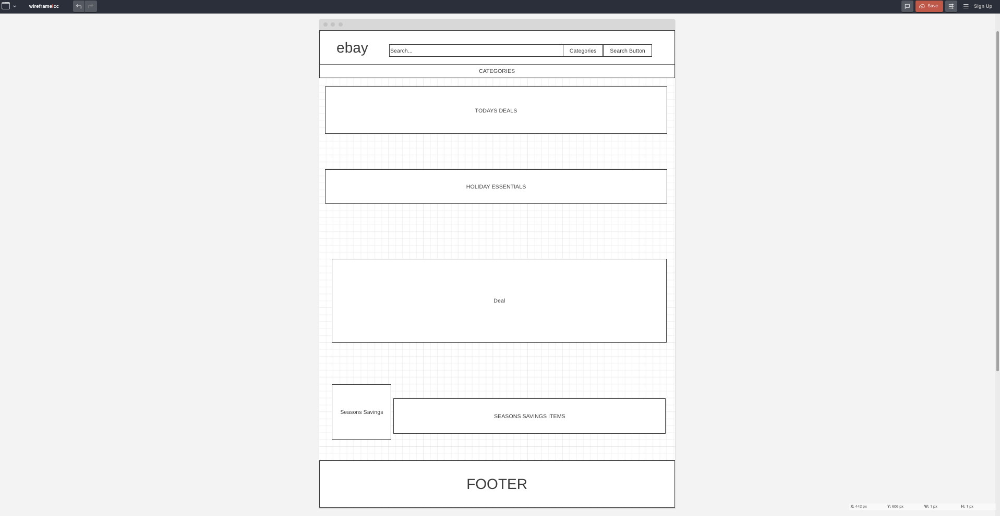

# eBay: An Online Marketplace Overview

## Introduction:
eBay is a renowned online marketplace that allows individuals and businesses to buy and sell a diverse range of goods and services. Sellers can create listings, set specific prices, or opt for an auction-style format. Buyers can bid on items, browse listings, or make instant purchases using the "Buy It Now" option.

## Methodology:
For this analysis, I compared websites with excellent user experience (UX) to eBay. I utilized heuristics to assess their satisfaction levels and evaluated website functionality to gauge efficiency.

## Good Findings:
- **User Control and Freedom:** Users have significant control; categories lead to multiple pages, enhancing the browsing experience.
- **Visibility and Efficiency:** All essential information is easily accessible, ensuring a seamless user experience.

## Bad UX Findings:
- **Aesthetic and Minimalist Design (Heuristic #8):** The website lacks a minimalist design, causing visual overload for users.
- **Error Prevention (Heuristic #5):** Absence of error prevention measures, such as confirming item removal from the cart, could lead to user frustration.

## Impact Assessment:
Addressing these UX issues is crucial for several reasons:
- **Aesthetic Appeal:** A minimalist design improves the website's visual appeal, crucial within the first 30 seconds of user interaction.
- **Error Prevention:** Implementing error prevention mechanisms enhances user efficiency, reducing mistakes during transactions.

## Recommendations:

## Conclusions:
Adopting a minimalist approach can significantly enhance the website's efficiency and user engagement. Prioritizing UX improvements will likely increase user satisfaction and encourage longer website interactions.
