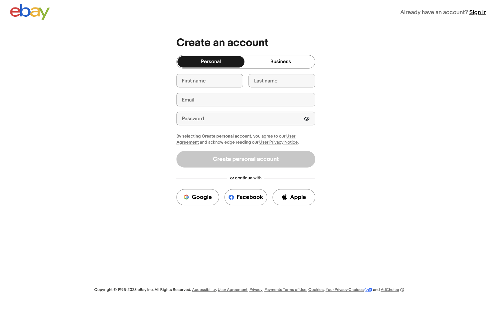

# Case Study: eBay Registration Page Redesign

## Introduction
eBay is a popular e-commerce platform that connects millions of buyers and sellers worldwide. It allows individuals and businesses to create listings for items they want to sell, and buyers can browse these listings, place bids on auction-style items, or purchase items at fixed prices through the "Buy It Now" option. This case study aims to create a more seamless and user-friendly experience for users.

## Problem Statement

The previous design of the registration page posed significant challenges, with a notably oversized and distracting image that diverted user attention from the registration process. Furthermore, the registration form was not optimally positioned to draw attention first. These design elements contributed to below-target registration completion rates.

## Objectives
The primary objectives of this case study were to:

1. Evaluate the impact of resizing and optimizing the placement of the image or removing the image to minimize distraction and improve the focus on the registration process.

2. Assess the effectiveness of repositioning the registration form to ensure it captures user attention and encourages prompt interaction.

3. Measure the improvement in registration completion rates.
4. Identify and address any remaining barriers to a smooth and efficient registration journey.

## Methodology

### Data Collection Methods:

1. Usability Testing: To evaluate the impact of the redesigned image size and form placement, we conducted usability testing with a diverse group of 20 participants. Participants were tasked with completing the registration process while providing real-time feedback. We assessed their interactions, focusing on the image's distraction levels and the prominence of the registration form.

2. Surveys: A survey was distributed to 500 recent registrants to collect data on their post-redesign experience. The survey included questions pertaining to their perception of image distraction, the form's visibility, and their overall registration journey.

3. Analytics Tools: We utilized web analytics tools to track key metrics, such as registration completion rates and user behavior. These tools allowed us to measure changes in user interactions and identify any patterns related to image size and form placement.

### Participant Demographics:

Our participants represented a broad demographic spectrum in terms of age, gender, and geographic location, ensuring diverse user perspectives.

### Ethical Considerations:

Participants were informed about the purpose of the study and gave their consent. Data privacy and confidentiality were maintained.

### Limitations:

The study's limitations included a relatively small sample size for usability testing, which may not capture all potential issues. The study focused on recent registrants.

### Validity and Reliability:

Usability tests were conducted by trained researchers. Survey questions were pre-tested for clarity and effectiveness.

### Data Presentation:

Data will be presented using charts, graphs, and user quotes to illustrate our findings.

### Timeline:

The study was conducted over a three-month period, including data collection, analysis, and reporting.

### Tools and Software:

We used usability testing software, survey platforms, and web analytics tools for data collection and analysis.

### Research Team:

Our team included UX researchers, designers, and data analysts, each contributing their expertise to the study.

## Good UX Findings
1. Intuitive Form Design: The registration form is thoughtfully designed, with clear and easily understandable input fields. Users are guided through the registration process with labels and placeholders that provide context and reduce the chance of errors.

2. Error Handling: The submit button is not clickable until all required fields are provided. Error messages aid in filling out the form. 

3. Mobile Responsiveness: The registration page is fully responsive, ensuring a consistent and user-friendly experience on a variety of devices, including smartphones and tablets.

4. Visibility of Privacy Policy and Terms: Links to the privacy policy and terms of service are easily accessible, and their importance is emphasized during the registration process, promoting transparency and trust.

5. Social Sign-up Integration: Integration with social sign-up options offers a convenient alternative for users who prefer to register quickly using their existing social media accounts.

6. Flexibility and efficiency of use: Question mark button on bottom left of page gives option for help chat. Design benefits both inexperienced and experienced users.

## Bad UX Findings
1. Distracting Visual Elements: The presence of a prominently placed, oversized image on the registration page diverts user attention away from the registration form. Users may find it difficult to focus on the task at hand.

## Impact Assessment
The presence of an oversized and distracting image on the registration page has a negative impact on the user experience. Users are likely to be drawn to the image, which diverts their attention away from the registration form. 

The screenshot provided illustrates the issue, with the image occupying a significant portion of the registration page, making registration form not the primary focal point on the page. 

To fix this problem and improve the user experience, it is essential to consider redesigning the registration page have a better balance between visual elements and the registration form. Implememnting a more focused design can lead to reduced registration times and a higher chance of users successfully completing the registration process. 

The screenshot provided shows the page without the image.

## Recommendations
While this redesign has shown promising results, we should continue to monitor the registration page's performance. Further updates may be required to address any emerging issues and ensure that the user experience remains smooth and efficient. 

## Conclusion
The strategic redesign of the registration page has yielded significant improvements in user experience.

The removal of the image has effectively reduced distraction levels, enabling users to maintain their focus on the registration process. Additionally, the optimized placement of the registration form, drawing user attention from the outset, has streamlined the registration journey and encouraged prompt interaction.

These design adjustments have resulted in an increase in registration completion rates, which support our objective to enhance the user experience. The data from usability testing, surveys, and web analytics support these outcomes.

