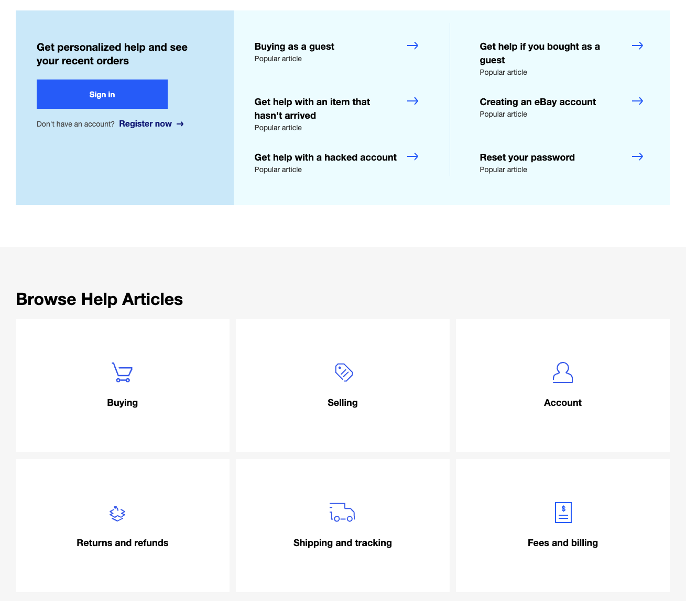
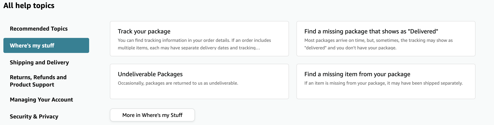

1. **Introduction:** eBay is a website where you can buy and sell items. You can search for a particular item or filter by category.
1. **Methodology:** I clicked through the website to gauge its ease of use. I specifically wanted to see how the help and contact page works.
1. **Good UX Findings:** The Help page lets you type in what you may need help with. This is simple and easy to use, even for someone who is not very tech-savvy. The help search bar remains at the top of the page, even while scrolling down.

1. **Bad UX Findings:** There are a lot of different things you can click on for help. It seems really busy and makes it easy to get lost. Clicking on one of the help elements will take you to yet another page where you have to read through information to see if your question is answered there.

1. **Impact Assessment:** A user not being able to find help on eBay can result in them not using the site. This can lead to the company losing a potential customer and could impact profits.
1. **Recommendations:** 
- Filter different help categories on the help page instead of having to click on a category which will then take you to another page where there is filtered information. For example, Amazon filters on the help page. 

- Remove one of the sections where help articles are shown. Only one is needed.

1. **Conclusion:** Websites can be difficult to navigate. Websites with good UI and UX will have a help page that will help a user with any questions or issues they might have. eBay has a help page, but it can be busy and difficult to use. Making the help page less cluttered and more intuitive will make users want to come back and potentially spend money.